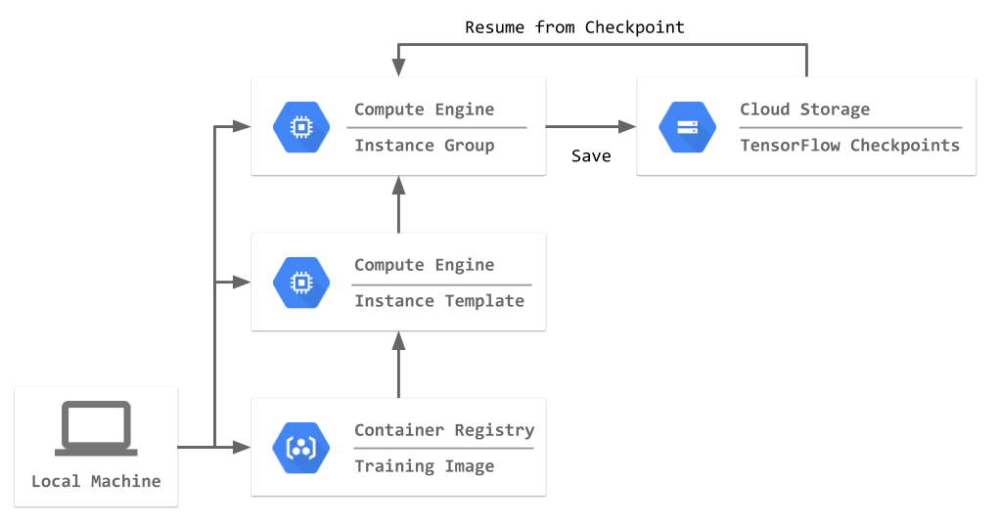

# An Example Using Preemptible VM for TensorFlow 

This is an example to use preemptible VM for machine learning.

## Requirements

* [Google Cloud SDK](https://cloud.google.com/sdk/install)
* Docker

## Architecture



### Key Points

- Use managed instance group with size one
  - Managed instance group can automatically restart preemptible VM
  - See the [official document](https://cloud.google.com/compute/docs/instances/preemptible#preemptible_with_instance_groups) for details
- Make your instance to run Docker container when the instance starts
  - [Container-Optimized OS](https://cloud.google.com/compute/docs/containers/deploying-containers) is used in this example
  - Another choice is using [startup script](https://cloud.google.com/compute/docs/startupscript) if you don't need Docker container
- Make instance group size zero after training finished

## Run on Cloud

### Configure Google Cloud SDK

```bash
gcloud config set account <your.google.account@gmail.com>
gcloud config set project <Your GCP Project>
gcloud auth configure-docker
```

### Build Docker Image

```bash
./bin/docker_build.sh
```

### Push Docker Image to Google Container Registry

```bash
./bin/docker_push.sh
```

### Create Instance Template and Managed Instance Group

```bash
./bin/create_instance_group.sh
```

## Run on Local

### Build Docker Image

```bash
./bin/docker_build.sh
```

### Run Docker Image

```bash
./bin/docker_run.sh
```
